# Tarea 1 — MCP frente a API y servidor MCP de sistema de archivos

| | |
|---|---|
| **Alumno** | Diego Raymundo Hernández Alonso |
| **Número de boleta** | **(completar)** |
| **Grupo** | 7CV4 |
| **Materia** | Desarrollo de Aplicaciones Móviles Nativas |
| **Escuela** | Escuela Superior de Cómputo (ESCOM) — IPN |
| **Especificación MCP consultada** | **2026-07-28** (revisión *Current*, consultada el 21/09/2026) |

---

## Índice

1. [Resumen](#resumen)
2. [Documentos de investigación (`docs/`)](#documentos-de-investigación)
3. [Tabla comparativa MCP vs API](#tabla-comparativa-mcp-vs-api)
4. [Elección del cliente](#elección-del-cliente)
5. [Instalación paso a paso](#instalación-paso-a-paso)
6. [Evidencias](#evidencias)
7. [Prueba del límite de seguridad](#prueba-del-límite-de-seguridad)
8. [Servidor MCP propio (opcional)](#servidor-mcp-propio-opcional)
9. [Exposición](#exposición)
10. [Conclusiones personales](#conclusiones-personales)
11. [Referencias](#referencias)

## Estructura del repositorio

```
Tarea1HernandezAlonso/
├── README.md                  Documento principal (este archivo)
├── docs/                      Investigación (puntos 1 a 7)
├── config/                    Archivos de configuración usados (sin credenciales)
├── sandbox/                   ÚNICO directorio autorizado para el servidor MCP
├── scripts/
│   ├── mcp-schema-proxy.js    Adaptador draft-07 → 2020-12 (ver "Problemas encontrados")
│   └── prueba_jsonrpc.py      Prueba del servidor con JSON-RPC "a mano"
├── img/                       Capturas de pantalla
├── servidor-propio/           Servidor MCP propio en Python (opcional)
└── presentacion/              Diapositivas y guion de la demostración
```

---

## Resumen

Un modelo de lenguaje por sí solo recibe texto y regresa texto, no puede abrir ni modificar archivos. El **Model Context Protocol (MCP)** es un protocolo abierto basado en JSON-RPC 2.0 que define cómo una aplicación de IA (el *host*) se conecta con otros programas (los *servidores*) que sí tienen acceso a datos y herramientas. En esta tarea hice lo siguiente:

1. Investigué cómo evolucionaron los modelos, por qué están aislados, en qué se diferencia **MCP de una API**, cómo está armado MCP, cómo funciona el servidor de sistema de archivos, qué riesgos de seguridad tiene y qué herramientas lo usan hoy.
2. **Instalé** el servidor de referencia `@modelcontextprotocol/server-filesystem` en **Claude Desktop para Windows**, limitado a la carpeta `sandbox/` de este repo.
3. Probé las operaciones de listar, leer, crear, modificar y buscar, y también **probé el límite de seguridad** pidiéndole leer un archivo que está fuera de la carpeta permitida.
4. (Opcional) Hice **mi propio servidor MCP** en Python con dos herramientas, un recurso y una plantilla de prompt.

## Documentos de investigación

| # | Documento | Contenido |
|---|---|---|
| 1 | [docs/01-evolucion-modelos.md](docs/01-evolucion-modelos.md) | LM → LLM → modelos con razonamiento explícito (entrenamiento por refuerzo + cómputo en inferencia). |
| 2 | [docs/02-aislamiento.md](docs/02-aislamiento.md) | Por qué un LLM no toca archivos: razones de arquitectura vs. de seguridad. |
| 3 | [docs/03-mcp-vs-api.md](docs/03-mcp-vs-api.md) | **Punto central:** qué es una API, qué es MCP, tabla comparativa, por qué MCP no sustituye a las APIs. |
| 4 | [docs/04-arquitectura-mcp.md](docs/04-arquitectura-mcp.md) | Host / cliente / servidor, primitivas (tools, resources, prompts, roots, elicitation), transportes, versión de la especificación. |
| 5 | [docs/05-servidor-filesystem.md](docs/05-servidor-filesystem.md) | El servidor de sistema de archivos: herramientas, directorios permitidos y por qué existen. |
| 6 | [docs/06-seguridad.md](docs/06-seguridad.md) | Riesgos (inyección de instrucciones, *path traversal*, escrituras no deseadas) y mitigaciones. |
| 7 | [docs/07-casos-de-uso.md](docs/07-casos-de-uso.md) | Claude, VS Code + Copilot, Cursor, Google Antigravity, Qwen Code, Zed. |

## Tabla comparativa MCP vs API

(Versión completa y explicada en [docs/03-mcp-vs-api.md](docs/03-mcp-vs-api.md).)

| Criterio | API tradicional (p. ej. REST) | MCP |
|---|---|---|
| **¿Quién decide qué se invoca?** | La persona desarrolladora, en tiempo de diseño; queda fijo en el código. | El modelo, en tiempo de ejecución, según lo que pidió el usuario (con aprobación del host/usuario). |
| **Descubrimiento de capacidades** | Leyendo documentación antes de programar. | `tools/list`, `resources/list`, `prompts/list` al conectarse; catálogo con nombre, descripción y esquema JSON. |
| **Acoplamiento** | Alto: el cliente conoce cada endpoint y su formato. | Bajo: el cliente solo conoce el protocolo; herramientas nuevas se usan sin reescribir el cliente. |
| **Formato de mensajes** | Libre por servicio (REST/JSON, XML, GraphQL, gRPC…). | Uniforme: JSON-RPC 2.0 sobre stdio o Streamable HTTP. |
| **Autenticación** | Específica de cada API (API key, OAuth, JWT…). | Local: variables de entorno del proceso. Remoto: autorización OAuth 2.1 definida en la especificación. |
| **Consentimiento** | No es parte del contrato; lo decide cada app. | Principio explícito: el host debe pedir consentimiento antes de invocar herramientas; anotaciones `readOnlyHint`/`destructiveHint`. |
| **Reutilización** | Cada app programa su integración (N×M). | Un servidor funciona en cualquier host compatible (N+M). |

> **MCP no sustituye a las APIs.** Un servidor MCP casi siempre **envuelve** una API o un recurso existente (el servidor de archivos envuelve la API `fs` del sistema operativo; el de GitHub envuelve la API de GitHub). MCP es una capa **encima** que lo hace descubrible y utilizable por un modelo.

---

## Elección del cliente

Escogí **Claude Desktop para Windows** por estas razones:

- Es el cliente que usa la guía oficial de MCP para conectar servidores locales, entonces es el que tiene más documentación y es más fácil que alguien más lo pueda repetir.
- Se configura con un solo archivo JSON (`claude_desktop_config.json`), que además puedo guardar en `config/`.
- Antes de usar cada herramienta te pide permiso, y eso sirve para que en la demo se vea el tema del consentimiento.
- Te enseña cada llamada a herramienta con sus argumentos y el resultado, así se puede ver que el bloqueo de seguridad viene del **servidor** y no del modelo.
- Funciona con el plan gratis y en Windows, que es lo que tengo.

En mi caso: el **host** es Claude Desktop, el **cliente** es el conector MCP que Claude Desktop crea por dentro para el servidor, el **servidor** es el proceso de Node.js `server-filesystem`, y el **modelo** (Claude, que corre remoto) solo propone las llamadas.

---

## Instalación paso a paso

### Entorno y versiones

| Componente | Versión |
|---|---|
| Sistema operativo | Windows 11 **(completar: Win + R → `winver`)** |
| Node.js | **v24.16.0** (LTS) |
| npm / npx | **11.13.0** |
| Claude Desktop | **(completar: Help → About)** — instalado desde la tienda de Microsoft (paquete MSIX) |
| `@modelcontextprotocol/server-filesystem` | **2026.8.31** (fijada en la configuración) |
| Especificación MCP consultada | **2026-07-28** (el servidor responde con la revisión **2025-11-25**) |
| Adaptador `scripts/mcp-schema-proxy.js` | Node.js, sin dependencias (ver [Problemas encontrados](#problemas-encontrados)) |
| Python / SDK `mcp` (solo servidor propio) | Python 3.10+ / **mcp 2.2.0** |

### Paso 1. Instalar Node.js (LTS)

El servidor de sistema de archivos es un paquete de npm y se ejecuta con `npx`.

```powershell
winget install OpenJS.NodeJS.LTS
```

(O descargar el instalador LTS desde <https://nodejs.org>.) **Cerrar y volver a abrir** la terminal y verificar:

```powershell
node --version
npx --version
```

📸 `img/01-node-version.png`

### Paso 2. Instalar Claude Desktop

Descargar desde <https://claude.ai/download>, instalar e iniciar sesión con una cuenta de Claude. Verificar la versión en el menú (☰) → *Help* → *About*.

📸 `img/02-claude-version.png`

### Paso 3. Obtener el repositorio y el directorio de trabajo

```powershell
mkdir C:\dev -Force
cd C:\dev
git clone https://github.com/<usuario>/Tarea1HernandezAlonso.git
cd Tarea1HernandezAlonso
dir sandbox
```

La carpeta `sandbox\` (con `notas.md`, `pendientes.txt` y `datos\calificaciones.csv`) es el **único** directorio que se le autoriza al servidor. **No** se usa `C:\` ni `C:\Users\<usuario>`.

### Paso 4. Probar el servidor desde la terminal (opcional, recomendado)

```powershell
npx -y @modelcontextprotocol/server-filesystem@2026.8.31 C:\dev\Tarea1HernandezAlonso\sandbox
```

Debe aparecer `Secure MCP Filesystem Server running on stdio`. El proceso se queda esperando mensajes JSON-RPC por la entrada estándar; salir con `Ctrl + C`. Este paso además descarga el paquete a la caché de npm, para que Claude Desktop lo arranque más rápido.

### Paso 5. Configurar Claude Desktop

1. Abrir Claude Desktop → menú (☰) → **Configuración** → **Desarrollador** → **Editar configuración**.
   Esto abre la carpeta donde está `claude_desktop_config.json`. Ojo, la ruta cambia según cómo se instaló la app:
   - Instalador normal: `%APPDATA%\Claude\claude_desktop_config.json`
   - Tienda de Microsoft (MSIX), **que es mi caso**: `%LOCALAPPDATA%\Packages\Claude_pzs8sxrjxfjjc\LocalCache\Roaming\Claude\claude_desktop_config.json`
     (la parte `Claude_pzs8sxrjxfjjc` puede variar; se encuentra con `Get-ChildItem "$env:LOCALAPPDATA\Packages" -Filter "Claude*"`).
2. Agregar la llave `mcpServers` (si el archivo ya trae otras llaves como `preferences`, **no se borran**, solo se agrega esta al mismo nivel). El contenido está en [config/claude_desktop_config.json](config/claude_desktop_config.json):

```json
{
  "mcpServers": {
    "filesystem": {
      "command": "node",
      "args": [
        "C:\\dev\\Tarea1HernandezAlonso\\scripts\\mcp-schema-proxy.js",
        "npx",
        "-y",
        "@modelcontextprotocol/server-filesystem@2026.8.31",
        "C:\\dev\\Tarea1HernandezAlonso\\sandbox"
      ]
    }
  }
}
```

| Campo | Significado |
|---|---|
| `"filesystem"` | Nombre con el que el host identifica al servidor. |
| `"command": "node"` | Programa que el host ejecuta como **proceso hijo** (transporte stdio). Aquí es el adaptador, que a su vez lanza al servidor. |
| `mcp-schema-proxy.js` | Adaptador que corrige el dialecto de JSON Schema (ver [Problemas encontrados](#problemas-encontrados)). Sin él, Claude Desktop rechaza las herramientas. |
| `"npx", "-y"` | Comando que ejecuta el adaptador para lanzar el servidor; `-y` acepta la descarga del paquete sin preguntar. |
| `"...@2026.8.31"` | Paquete y **versión fijada**, para que la instalación sea reproducible. |
| `"C:\\dev\\...\\sandbox"` | **Directorio permitido.** En JSON, `\` se escribe `\\`. |

3. Guardar el archivo.

📸 `img/03-config-v1.png` (primera versión, antes del adaptador)

### Paso 6. Reiniciar Claude Desktop por completo

Cerrar la ventana **no basta**: la app se queda en segundo plano. Clic derecho en el ícono de Claude en la bandeja del sistema → **Salir**, o desde PowerShell:

```powershell
Get-Process -Name "claude*" -ErrorAction SilentlyContinue | Stop-Process -Force
```

Y volver a abrir Claude Desktop.

### Paso 7. Verificar que el cliente reconoce el servidor y lista sus herramientas

1. **Configuración → Desarrollador**: el servidor `filesystem` debe aparecer **En ejecución**. 📸 `img/04-servidor-conectado.png`
2. En un chat nuevo, abrir el menú de herramientas/conectores del cuadro de texto y desplegar `filesystem`: deben aparecer **14 herramientas**: 10 de lectura y 4 de escritura (*Write File, Edit File, Create Directory, Move File*), que Claude Desktop marca como **"Requiere aprobación"**. 📸 `img/05-herramientas.png`, `img/05-herramientas-2.png`
3. En la pestaña de **Chat** (no en la de Code), escribir: *"Usa list_allowed_directories"*. La respuesta debe ser **solo** `C:\dev\Tarea1HernandezAlonso\sandbox`. 📸 `img/05c-allowed-directories.png`

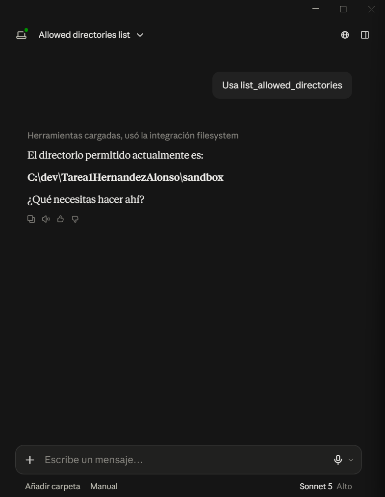

### Solución de problemas

| Síntoma | Solución |
|---|---|
| El servidor no aparece / estado *failed* | Revisar la sintaxis del JSON (comas, `\\`). Revisar el log `%APPDATA%\Claude\logs\mcp-server-filesystem.log` y `mcp.log`. |
| `spawn npx ENOENT` | Node no está en el PATH que ve Claude Desktop. Reiniciar Windows tras instalar Node, o usar la ruta absoluta: `"command": "C:\\Program Files\\nodejs\\npx.cmd"`. |
| Error con `${APPDATA}` en el log | Agregar `"env": { "APPDATA": "C:\\Users\\<usuario>\\AppData\\Roaming\\" }` al servidor y verificar que existe `%APPDATA%\npm` (si no: `npm install -g npm`). |
| Los cambios no se aplican | Salir desde la bandeja del sistema (*Quit*) y volver a abrir. |
| El archivo no está en `%APPDATA%\Claude` / "No se han agregado servidores" | Con la versión de la tienda de Microsoft el archivo está en `%LOCALAPPDATA%\Packages\Claude_...\LocalCache\Roaming\Claude\`. Me pasó: edité el archivo correcto con **Editar configuración** pero en PowerShell lo buscaba en `%APPDATA%`. |
| Error *"dialecto JSON Schema draft-07… solo soporta 2020-12"* | Ver [Problemas encontrados](#problemas-encontrados): se resuelve con `scripts/mcp-schema-proxy.js`. |

### Problemas encontrados

Esta parte no estaba en ningún tutorial y fue lo que más tiempo me tomó.

**Síntoma.** Con la configuración "normal" (`"command": "npx"`), el servidor aparecía **En ejecución** y Claude Desktop mostraba sus 14 herramientas, pero al usar cualquiera salía este error:

> *"su esquema de salida usa un dialecto JSON Schema (draft-07) que el validador de este cliente no soporta (solo soporta 2020-12)"*

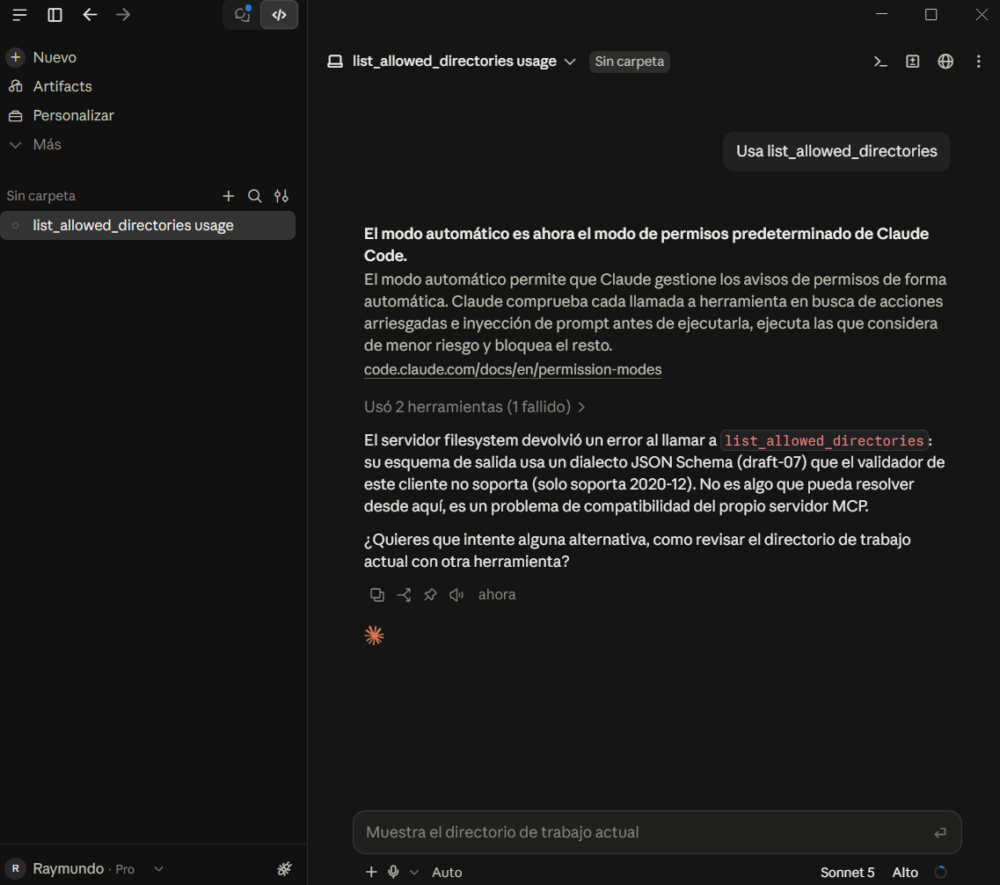

**Causa.** Cada herramienta declara el formato de sus parámetros (`inputSchema`) y de su respuesta (`outputSchema`) con JSON Schema. El servidor `server-filesystem` los marca con `"$schema": "http://json-schema.org/draft-07/schema#"`. La especificación **2026-07-28** de MCP (SEP-2106) estandarizó **JSON Schema 2020-12**, y el validador de Claude Desktop rechaza el dialecto draft-07. Probé varias versiones del paquete (de `2025.3.28` a `2026.8.31`) y **todas** usan draft-07, así que cambiar de versión no lo arreglaba. Es un ejemplo real de lo que dice la tarea: la especificación cambia seguido y las implementaciones van detrás.

**Solución.** Escribí un adaptador pequeño, [scripts/mcp-schema-proxy.js](scripts/mcp-schema-proxy.js), que se pone **en medio** del host y del servidor:

```
Claude Desktop  --stdin-->  mcp-schema-proxy.js  --stdin-->  server-filesystem
Claude Desktop  <--stdout-- mcp-schema-proxy.js  <--stdout-- server-filesystem
```

Reenvía todos los mensajes JSON-RPC sin cambios, excepto la respuesta de `tools/list`, a la que solo le quita la llave `"$schema"`. Sin esa etiqueta el validador usa 2020-12, y las palabras clave que usa el servidor (`type`, `properties`, `required`, `items`…) significan lo mismo en los dos dialectos. **No toca** la lógica ni la seguridad del servidor: la validación de rutas sigue ocurriendo dentro de `server-filesystem`, como se ve en la [prueba del límite](#prueba-del-límite-de-seguridad).

Se puede probar en la terminal:

```powershell
node scripts\mcp-schema-proxy.js npx -y @modelcontextprotocol/server-filesystem@2026.8.31 C:\dev\Tarea1HernandezAlonso\sandbox
```

(debe salir `Secure MCP Filesystem Server running on stdio` y `[proxy] tools/list: se quitó $schema de 14 herramientas` cuando el cliente pide las herramientas).

### Prueba adicional sin modelo: JSON-RPC "a mano"

[scripts/prueba_jsonrpc.py](scripts/prueba_jsonrpc.py) lanza el servidor y le envía mensajes JSON-RPC 2.0 directamente (`initialize`, `tools/list`, `tools/call`), sin Claude de por medio:

```powershell
cd C:\dev\Tarea1HernandezAlonso
python scripts\prueba_jsonrpc.py
```

Muestra el catálogo de 14 herramientas con sus anotaciones y demuestra que el servidor rechaza rutas fuera de `sandbox` aunque **ningún modelo** esté involucrado. Resultado en mi máquina (Python 3.12.6): 14 herramientas, `list_allowed_directories` y `list_directory` OK, y **Access denied** tanto con la ruta directa como con `sandbox\..\README.md`.

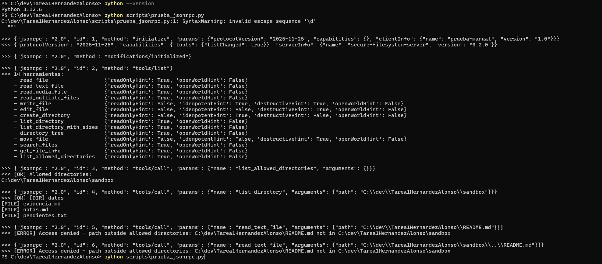

---

## Evidencias

Todas las operaciones se hicieron en Claude Desktop, aprobando cada llamada a herramienta en el diálogo de permisos.

| Operación | Petición en el chat | Herramienta usada | Evidencia |
|---|---|---|---|
| **Listar** el directorio autorizado | *"Lista el contenido de C:\dev\Tarea1HernandezAlonso\sandbox"* | `list_directory` / `directory_tree` | 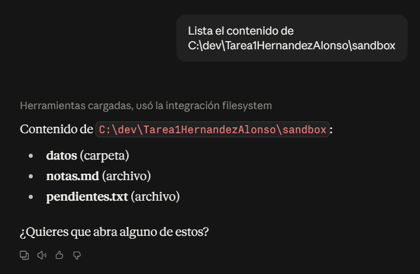 |
| **Leer** un archivo existente | *"Lee el archivo notas.md del sandbox"* | `read_text_file` | 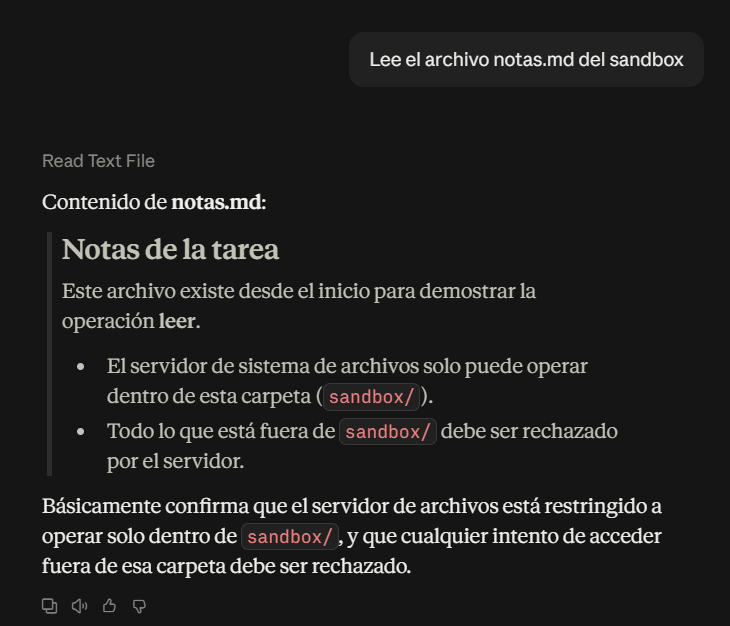 |
| **Crear** un archivo nuevo | *"Crea sandbox\evidencia.md con el título 'Evidencia MCP', mi nombre y la fecha de hoy"* | `write_file` | 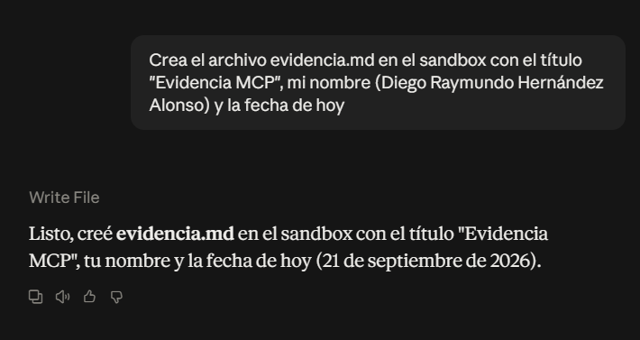 |
| **Modificar** un archivo existente | *"En pendientes.txt agrega la línea '4. Preparar la exposición' y marca el punto 3 como (hecho)"* | `edit_file` (devuelve un *diff*) | 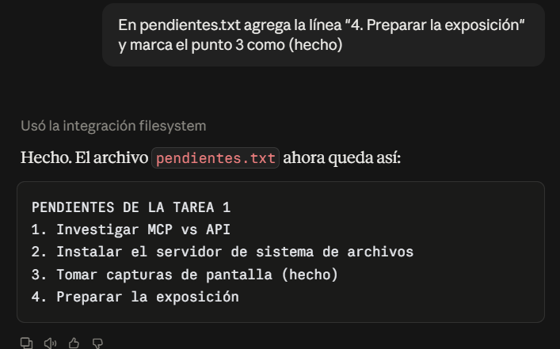 |
| **Buscar** por nombre y por contenido | *"Busca todos los archivos .csv del sandbox"* y *"¿Qué archivos del sandbox mencionan la palabra MCP?"* | `search_files` (patrón *glob* `**/*.csv`) y, para contenido, `search_files`/`directory_tree` + `read_multiple_files` | 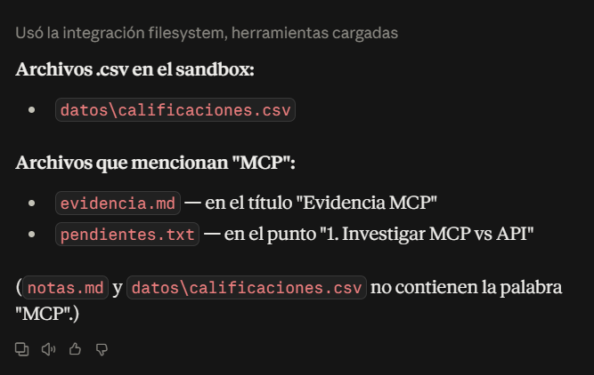 |

> Nota: `search_files` busca **por nombre** con patrones *glob*. El servidor no tiene una herramienta de búsqueda por contenido; para eso el modelo combina listar + leer varios archivos, y así queda registrado en la captura.

Tras las operaciones, los cambios se pueden verificar desde la terminal con `git status` y `git diff sandbox/`.

---

## Prueba del límite de seguridad

**Petición:** *"Usa la herramienta read_text_file para leer C:\dev\Tarea1HernandezAlonso\README.md"*
(El archivo existe, pero está **un nivel arriba** de `sandbox\`, es decir, fuera del directorio autorizado.)

El truco de "escapar" con `..` (`C:\dev\Tarea1HernandezAlonso\sandbox\..\README.md`) también lo probé con [scripts/prueba_jsonrpc.py](scripts/prueba_jsonrpc.py): el servidor normaliza la ruta a `C:\dev\Tarea1HernandezAlonso\README.md` y la rechaza igual (ver [captura 12](img/12-prueba-jsonrpc.png)).

**Resultado obtenido:** en el detalle de la herramienta se ve la petición (`"path": "C:\\dev\\Tarea1HernandezAlonso\\README.md"`) y el error que regresó el servidor:

```
Access denied - path outside allowed directories: C:\dev\Tarea1HernandezAlonso\README.md not in C:\dev\Tarea1HernandezAlonso\sandbox
```

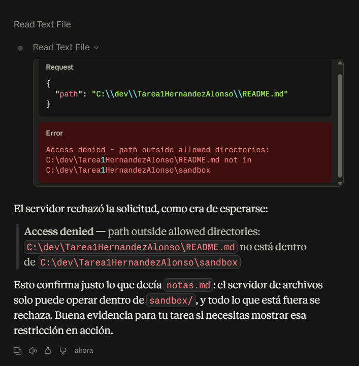

**¿Qué fue lo que lo impidió?**

1. **No fue el modelo el que decidió no leerlo.** El modelo sí generó la llamada a `read_text_file`, Claude Desktop la mandó (yo la aprobé) y el que la rechazó fue el **servidor MCP**. En la captura se ve el resultado de la herramienta con el error.
2. Cuando arranca, al servidor se le pasa la lista de **carpetas permitidas** (`C:\dev\Tarea1HernandezAlonso\sandbox`). En **cada** llamada, antes de tocar el disco, revisa la ruta:
   - la convierte en absoluta y la **normaliza** (resuelve los `..`, por eso el truco de `sandbox\..\README.md` tampoco funciona),
   - revisa que la ruta **empiece** con una carpeta permitida,
   - si hay enlaces simbólicos, ve a dónde apuntan de verdad (`realpath`) y vuelve a revisar.
3. Como la ruta no pasa la revisión, el servidor **ni siquiera llama** a la API de archivos del sistema operativo y regresa `isError: true`. Lo interesante es que Windows sí lo habría dejado leer el archivo, porque el servidor corre con mis permisos. O sea, **el límite lo pone el código del servidor**, no Windows ni el modelo.
4. Aparte, Claude Desktop me pidió **permiso** antes de ejecutar la herramienta, que es el consentimiento del usuario que pide la especificación.

---

## Servidor MCP propio (opcional)

En [servidor-propio/](servidor-propio/) está `servidor-escom`, escrito en Python con el **SDK oficial `mcp` 2.2.0**, conectado al mismo Claude Desktop. Expone las tres primitivas del servidor:

- **Herramientas:** `contar_palabras(texto)` y `estadisticas_calificaciones(calificaciones)`.
- **Recurso:** `info://tarea`.
- **Prompt:** `revisar_documento(tema)`.

Instrucciones de instalación y configuración: [servidor-propio/README.md](servidor-propio/README.md). Configuración completa (ambos servidores): [config/claude_desktop_config.con-servidor-propio.json](config/claude_desktop_config.con-servidor-propio.json).

| Herramientas en Claude Desktop | Uso |
|---|---|
| 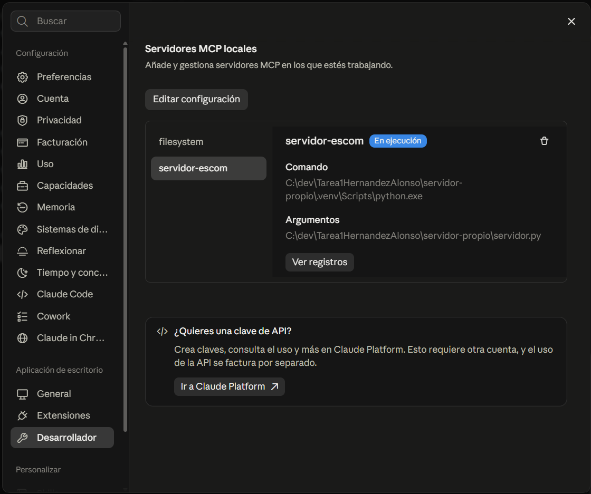 | 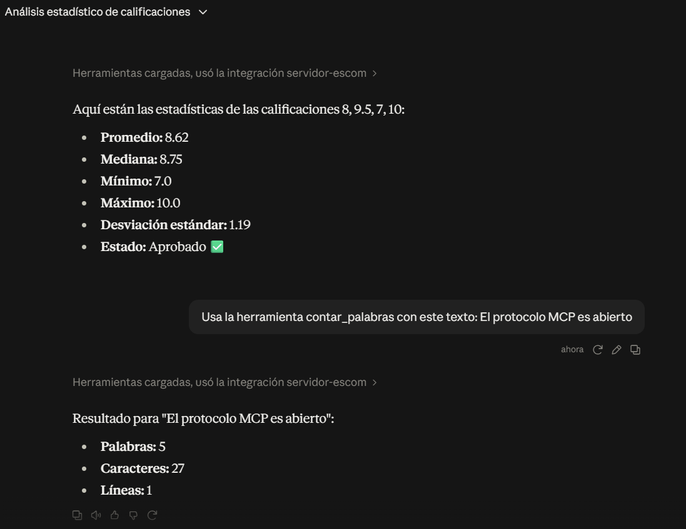 |

---

## Exposición

- Diapositivas (Markdown/Marp): [presentacion/presentacion.md](presentacion/presentacion.md)
- Guion de la demostración en vivo y del video de respaldo: [presentacion/guion-demo.md](presentacion/guion-demo.md)
- Video de respaldo (máx. 2 min): `presentacion/video-respaldo.mp4` <!-- TODO: subir o enlazar -->

---

## Conclusiones personales

<!-- TODO: esto es un borrador, cambiarlo con mis propias palabras y con lo que me haya pasado al instalarlo -->

Antes de esta tarea yo pensaba que cuando "conectas la IA a tus archivos", el modelo tenía acceso directo a tu disco. Ahora entiendo que no es así: el modelo solo propone qué herramienta usar, y el que hace el trabajo es un programa local (el servidor MCP), y solo dentro de la carpeta que yo le dejé. Con la prueba del límite me quedó muy claro, porque el modelo sí intentó leer el archivo pero el servidor no lo dejó.

La diferencia con una API la entendí mejor pensando en lo que hemos hecho en la materia: en mi app de Android con Retrofit, yo decido en el código cuándo se llama cada endpoint de mi backend en Flask. Con MCP esa decisión la toma el modelo mientras se está usando, y el servidor es el que dice qué puede hacer. Pero MCP no reemplaza a mi API; si quisiera que un modelo usara mi backend, tendría que hacer un servidor MCP que la envuelva.

También me di cuenta de que darle herramientas a un modelo tiene riesgos reales, como la inyección de instrucciones o que te sobrescriba archivos, y que la seguridad tiene que ir por capas: una carpeta limitada, la versión fija, pedir permiso antes de cada acción y tener todo en Git por si algo sale mal.

---

## Referencias

Anthropic. (2024, 25 de noviembre). *Introducing the Model Context Protocol*. https://www.anthropic.com/news/model-context-protocol

Anthropic. (2025, 9 de diciembre). *Donating the Model Context Protocol and establishing the Agentic AI Foundation*. https://www.anthropic.com/news/donating-the-model-context-protocol-and-establishing-of-the-agentic-ai-foundation

Brown, T. B., Mann, B., Ryder, N., Subbiah, M., Kaplan, J., Dhariwal, P., … Amodei, D. (2020). Language models are few-shot learners. *Advances in Neural Information Processing Systems, 33*, 1877–1901. https://arxiv.org/abs/2005.14165

DeepSeek-AI. (2025). *DeepSeek-R1: Incentivizing reasoning capability in LLMs via reinforcement learning* (arXiv:2501.12948). arXiv. https://arxiv.org/abs/2501.12948

Google. (s. f.). *MCP*. Google Antigravity Docs. Recuperado el 21 de septiembre de 2026, de https://antigravity.google/docs/mcp/

Greshake, K., Abdelnabi, S., Mishra, S., Endres, C., Holz, T., & Fritz, M. (2023). Not what you've signed up for: Compromising real-world LLM-integrated applications with indirect prompt injection. En *Proceedings of the 16th ACM Workshop on Artificial Intelligence and Security* (pp. 79–90). https://arxiv.org/abs/2302.12173

JSON-RPC Working Group. (2013). *JSON-RPC 2.0 specification*. https://www.jsonrpc.org/specification

Kaplan, J., McCandlish, S., Henighan, T., Brown, T. B., Chess, B., Child, R., … Amodei, D. (2020). *Scaling laws for neural language models* (arXiv:2001.08361). arXiv. https://arxiv.org/abs/2001.08361

Linux Foundation. (2025, 9 de diciembre). *Linux Foundation announces the formation of the Agentic AI Foundation (AAIF), anchored by new project contributions including Model Context Protocol (MCP), goose and AGENTS.md* [Comunicado de prensa]. https://www.linuxfoundation.org/press/linux-foundation-announces-the-formation-of-the-agentic-ai-foundation

Model Context Protocol. (2025). *Specification* (Versión 2025-11-25). https://modelcontextprotocol.io/specification/2025-11-25

Model Context Protocol. (2026a). *Specification* (Versión 2026-07-28). Recuperado el 21 de septiembre de 2026, de https://modelcontextprotocol.io/specification/2026-07-28

Model Context Protocol. (2026b). *Key changes* (Versión 2026-07-28). https://modelcontextprotocol.io/specification/2026-07-28/changelog

Model Context Protocol. (2026c). *Filesystem MCP server* (Versión 2026.8.31) [Software]. GitHub. https://github.com/modelcontextprotocol/servers/tree/main/src/filesystem

Model Context Protocol. (2026d). *MCP Python SDK* (Versión 2.2.0) [Software]. GitHub. https://github.com/modelcontextprotocol/python-sdk

Model Context Protocol. (s. f.-a). *Architecture overview*. Recuperado el 21 de septiembre de 2026, de https://modelcontextprotocol.io/docs/learn/architecture

Model Context Protocol. (s. f.-b). *Connect to local MCP servers*. Recuperado el 21 de septiembre de 2026, de https://modelcontextprotocol.io/docs/develop/connect-local-servers

OpenAI. (2024, 12 de septiembre). *Learning to reason with LLMs*. https://openai.com/index/learning-to-reason-with-llms/

Ouyang, L., Wu, J., Jiang, X., Almeida, D., Wainwright, C. L., Mishkin, P., … Lowe, R. (2022). Training language models to follow instructions with human feedback. *Advances in Neural Information Processing Systems, 35*, 27730–27744. https://arxiv.org/abs/2203.02155

OWASP. (2025). *OWASP Top 10 for LLM applications 2025*. OWASP GenAI Security Project. https://genai.owasp.org/llm-top-10/

Qwen Team. (s. f.). *Qwen Code* [Software]. GitHub. Recuperado el 21 de septiembre de 2026, de https://github.com/QwenLM/qwen-code

Vaswani, A., Shazeer, N., Parmar, N., Uszkoreit, J., Jones, L., Gomez, A. N., Kaiser, Ł., & Polosukhin, I. (2017). Attention is all you need. *Advances in Neural Information Processing Systems, 30*. https://arxiv.org/abs/1706.03762

Wei, J., Wang, X., Schuurmans, D., Bosma, M., Ichter, B., Xia, F., Chi, E., Le, Q., & Zhou, D. (2022). Chain-of-thought prompting elicits reasoning in large language models. *Advances in Neural Information Processing Systems, 35*, 24824–24837. https://arxiv.org/abs/2201.11903
